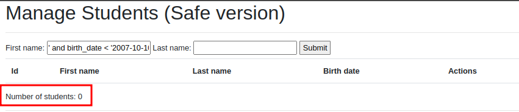

# sql Injection

Essentially, the application allows the user to search students by their first or last names, or delete existing ones.

The application is quite basic and designed to easily show the existing SQL injection vulnerabilities just by using the browser. For example, it uses the HTTP method GET for all transactions (although usually forms would be sent using methods POST or PUT).

Also, the database also includes some clear-text passwords. This is for the sake of clarity in this tutorial—I honestly hope you don’t ever design a database or an app this way.

<hr>

### What is SQL injection?

SQL injection is a code injection technique, used to attack data-driven applications, in which malicious SQL statements are inserted into an entry field for execution (e.g. to dump the database contents to the attacker). SQL injection must exploit a security vulnerability in an application's software, for example, when user input is either incorrectly filtered for string literal escape characters embedded in SQL statements or user input is not strongly typed and unexpectedly executed. SQL injection is mostly known as an attack vector for websites but can be used to attack any type of SQL database.

<hr>

### Exploit a Simple SQL Injection Vulnerability


In SQL, string parameters are wrapped between quote symbols. Usually, they use single-quotes ', though some database servers also allow using double-quotes " to wrap strings. These quote symbols separate string parameters in the SQL query from all the other components of the query.

We are going to try escaping from the SQL query field parameter—in which the application used the input—so it becomes something else.

So, if we are trying to escape from a string in SQL, we will need to use the same wrapping character that was used to start the string. As we said, this is typically the single-quote ', although some database engines also support the double-quote ". After this character, we need to add contents so the SQL query is still valid. And, finally, we need to mark the end of the SQL command (with the semicolon character ;). We also need the server to ignore the remaining characters added by the original software, so we’ll typically use the strings --, # or /\*, depending on the engine running the database server. In our case (SQLite), we’ll use --.

So, let’s try searching for students including the following first name:

`' and birth_date < '2007-10-10'; --.`

The application will build this SQL query:

```sql
SELECT * FROM students WHERE first_name = LIKE '%' and birth_date < '2007-10-10'; --%' LIMIT 5;
```

By escaping from the place where the input string was originally intended, we get these results.


The query is now valid, and it returns all the students whose birth date is before 2007-10-10. Additionally, the limit that shows only 5 students per screen has been disabled. Essentially, we have taken control of the returned output

let’s try viewing hidden users. We can search for students with the following last name:

`' or 1=1 ;--`

we can see the full list of all students, including those that were previously hidden (only one, in our example database).


<hr>

### Preventing SQL Injection attacks in PHP

The best way to sanitize inputs when building SQL queries is by using prepared statements.

So, the unsafe code from `includes/delete.php:`

```php
$id = $_GET['id'];

$delete_query = 'DELETE FROM students where id = ' . $id;

$result = $pdo->exec( $delete_query );
```

where the $id parameter isn’t sanitized when building the executed SQL query will become: in includes/deleteSafe.php:

```php
$id = $_GET['id'];

$delete_query = 'DELETE FROM students where id = :id';

$prepared_statement = $pdo->prepare( $delete_query );
$prepared_statement->bindParam('id', $id );
$prepared_statement->execute();

$result = $prepared_statement->rowCount();
```

The PDO library and/or its dependencies will take care of applying the corresponding escaping to the provided parameters when binding parameters.

The safe version of the app, available at `manageStudentSafe.php`, filters and sanitizes all the inputs used to build SQL queries, preventing SQL injection attacks.


